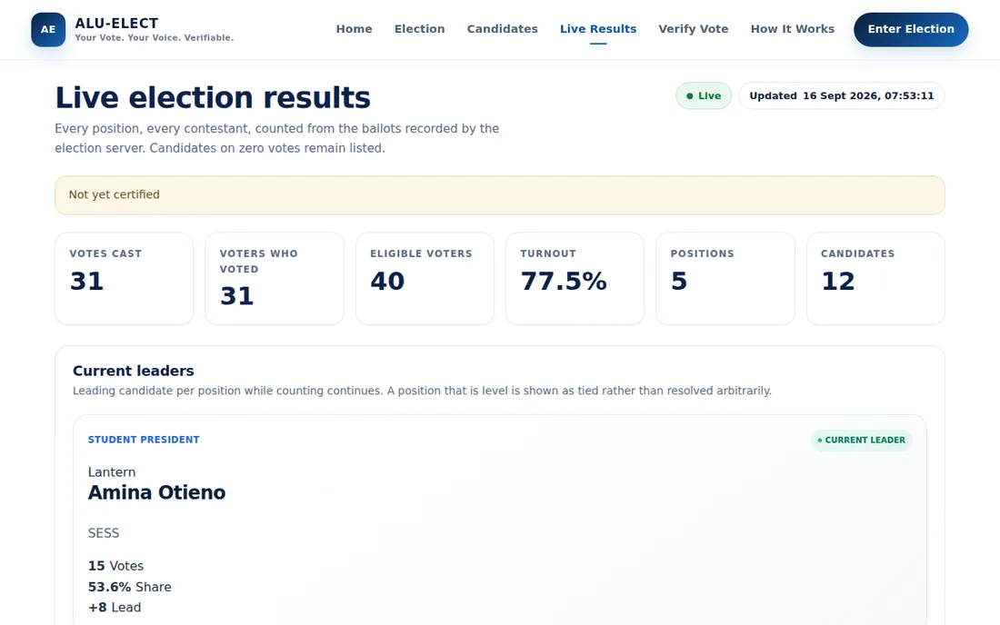
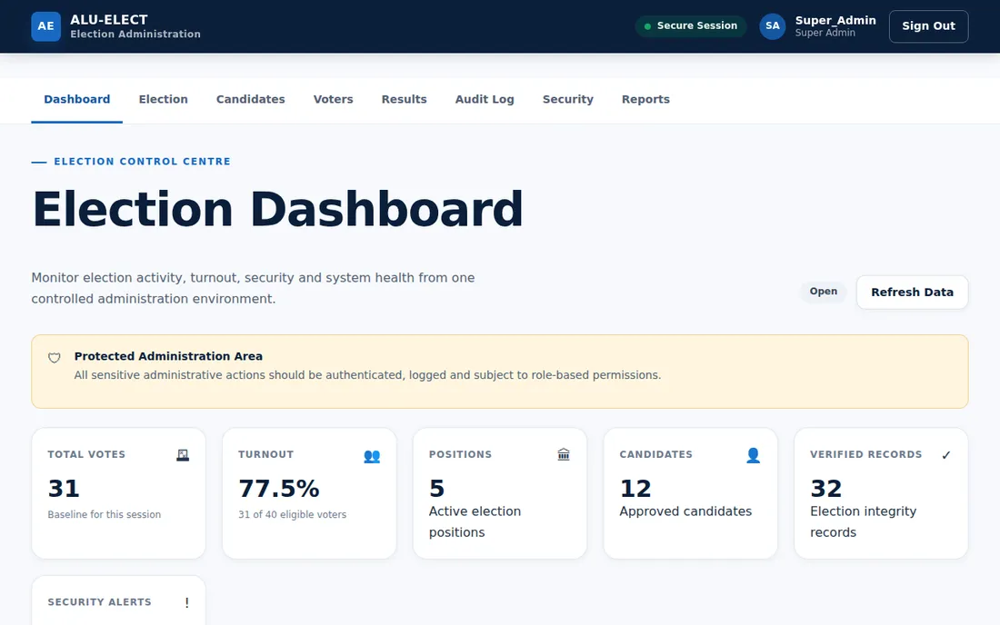

# ALU-ELECT — Student Election System

**Your vote. Your voice. Verifiable.** A student election platform built for Alupe University: secret ballots, one vote per student, verifiable receipts, live results and a role-based admin dashboard — with a Flask + PostgreSQL back end.



## What it does

- **Voting:** students sign in with their student number, see every position and candidate, and cast one ballot. Abstaining from a position is allowed; a second ballot is refused by the database itself.
- **Receipts and verification:** every voter gets a receipt reference and can check that their ballot was counted, without the receipt revealing who they voted for.
- **Live results:** turnout, current leaders and a per-position race tracker, streamed to the browser with Server-Sent Events. Ties are shown as ties.
- **Admin dashboard:** elections, candidates, voters, results, audit log, security and reports, with five roles (super admin, election admin, results officer, auditor, read-only).
- **Election state machine:** draft → scheduled → open (can be paused) → closed → counting → certified → archived, with sensitive actions requiring re-authentication.
- **Audit ledger:** every election event is written to a hash-chained log; `GET /api/ledger/status` reports whether the chain is intact and, if not, exactly where it breaks.



## How the secret ballot is protected

The database is split so the system *cannot* answer "who did this student vote for?":

| Layer | Tables | Knows | Never knows |
|---|---|---|---|
| Eligibility | `voters` | who may vote, and that they voted | what they chose |
| Ballot | `ballots`, `ballot_selections` | what was chosen | who chose it |
| Results | `results` | totals per candidate | anything per voter |

Ballot timestamps are coarsened to the hour, and receipts store a peppered commitment rather than the ballot id. A test reads the live schema to prove no column links a voter to a candidate. The full model — including known residual risks — is in [`docs/SECURITY.md`](docs/SECURITY.md).

## Tech stack

- **Back end:** Python, Flask 3 (application factory), SQLAlchemy 2, PostgreSQL 16 (psycopg 3), Argon2 password hashing, gunicorn
- **Security:** CSRF tokens, per-endpoint rate limits, security headers, CORS allow-list, role-based permissions
- **Front end:** HTML, CSS and vanilla JavaScript (no framework): home, candidates, voting, live results, receipt verification, how-it-works and admin pages
- **Tests:** pytest against a real PostgreSQL database, plus Playwright checks for the admin, candidates and results pages

## Verified status (16 September 2026)

| Component | Status |
|---|---|
| Secret-ballot schema, one-vote enforcement, ballot validation | Working — covered by tests |
| Receipts and verification | Working — covered by tests |
| Election state machine, 5-role access control | Working — covered by tests |
| Hash-chained audit ledger | Working — chain verified after test voting |
| HTTP API: auth, CSRF, rate limits, security headers | Working — covered by tests; rate limiting observed in use |
| Front end connected to the API | Working with the local dev server (results, admin sign-in and dashboard checked in a browser) |
| Live results stream (SSE) | Working locally — stream delivers current totals |
| Backend test suite | **103 tests pass** on PostgreSQL 16 |
| Permissioned blockchain | **Not connected** — development audit-ledger mode only |
| Alembic migrations | Not yet — `manage.py init-db` creates the schema |

## What this system does not claim

It is **not** "unhackable" and **not** blockchain-secured. The audit ledger is tamper-*evident* (tampering is detected and located), not tamper-*proof*: a database superuser could rewrite it. `ledger.py` defines a `LedgerBackend` interface so a permissioned network (e.g. Hyperledger Fabric or Besu) can be plugged in later without touching the voting code.

## Run it locally

```bash
cd backend
pip install -r requirements.txt
cp .env.example .env            # set DATABASE_URL, SECRET_KEY, BALLOT_PEPPER

python manage.py init-db
ALU_SEED_CONFIRM=yes python seed_dev.py    # fictional data; writes dev-credentials.csv
python devserver.py                         # http://127.0.0.1:8300 — front end + API on one origin
```

Run the tests against a **disposable** database (the suite refuses any database whose name doesn't contain `test`, `scratch` or `ci`):

```bash
TEST_DATABASE_URL=postgresql+psycopg://user@localhost/alu_test \
SECRET_KEY=test BALLOT_PEPPER=test python -m pytest tests/ -q
```

Production runs `wsgi.py` behind gunicorn and nginx — see [`docs/DEPLOYMENT.md`](docs/DEPLOYMENT.md). API endpoints are listed in [`docs/API.md`](docs/API.md).

## Project layout

```
index.html, election.html, candidates.html, results.html, verify.html, how-it-works.html, admin.html
css/  js/  img/            front end
backend/app/               Flask app: models, voting, governance, ledger, api, admin_api, auth, security
backend/tests/             pytest suite (real PostgreSQL)
tests/                     Playwright UI checks
docs/                      security model, API, deployment, screenshots
```

All candidate names, photos (initials placeholders) and voters in the seed data are fictional.

---
Built by [Emmanuel](https://baswet.github.io) · Kenya
